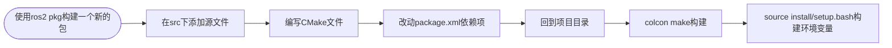

# Ros2 使用 

## 1. 基础认知

*运行小海龟*

~~~
ros2 run turtlesim turtlesim_node
~~~

*键盘控制小海龟*

```
ros2 run turtlesim turtle_teleop_key
```

>  rqt: 此命令可以查看各节点之间的话题通信


## 2.节点（node）

1. python实例

```python
import rclpy
from rclpy import rclpy.node
    
def main():    
    rclpy.init() # 为通信做初始化工作
    node = Node("pthonnode") # 创建一个节点变量
    node.get_logger().info("woshijun") # 用于获取日志文件 node.get_logger 这个命令后加的是或取得日志的级别,如info, warn等

    node.get_logger().info("woshipython")
    node.get_logger().warn("woshipython")
    rclpy.spin(node) # 运行这个节点
    rclpy.shutdown() # 关闭节点
```

> get_logger() 对应的日志级别 debug < info < warn < error < fatal


2. c++实例

```cpp
#include <iostream>
#include "rclcpp/rclcpp.hpp"


int main(int argc, char ** argv) //第一个参数是参数数量, 第二个是程序的参数,是一个字符串数组

{
    rclcpp::init(argc, argv);
    auto node = std::make_shared<rclcpp::Node>("cpp_node"); //make_shared是创建并且返回一个共享指针,Node
    RCLCPP_INFO(node->get_logger(), "cpp_node"); //返回一个日志
    rclcpp::spin(node); // 循环检测并且运行节点
    rclcpp::shutdown();
    return 0;
/*
*第一步是初始化.
*第二部是创建一个节点.
*第三步是打印日志.
*第四步是让节点运行.
*第五步是关闭节点.
*/
}

```


*cmake*:

使用前需要构建这个build文件夹

`cmake -S . -B build`

> 第一个s后边跟的是源码的文件夹, .就表示当下的文件夹的所有
>
> -B build表示的是构建目录,没有就直接新建

然后就构建

`cmake --build build`

eg.

```cmake
cmake_minimum_required(VERSION 3.11)
project(ros_cpp)


set(CMAKE_CXX_STANDARD 17)
set(CMAKE_CXX_STANDARD_REQUIRED ON)

find_package(rclcpp REQUIRED) # 找依赖项

target_include_directories(ros_cpp PRIVATE include) # 把依赖库头文件连接到可执行文件
target_link_libraries(ros_cpp ${rclcpp_LIBRARIES}) # 把库文件连接


aux_source_directory(src SRC) # a
add_executable(ros_cpp ${SRC}) # 生成可执行文件
```


### 2.2 功能包组织节点

1. python创建功能包

```bash
ros2 pkg create --build-type ament_python --license Apache-2.0 demo_python_pkg
```

> ros2 pkg 对应包的命令
>
> create是创建新的功能包
>
> --build-type是选取构建类型（默认是cpp的CMake）
>
> ament_python是要构建的类型
>
> demo_python_pkg是包的名字

创建好包之后，在包的子目录中选取同名的文件夹创建节点,注意不需要main的入口

之后在setup.py中找到entry_point写出入口：'入口名字 = 包名字.节点名字.函数名字'

之后在package.xml里面添加依赖项

最后利用`colcon build`构建文件，会产生三个文件夹（同级），build是中间文件，install是可执行文件，log是生成的日志


cPP流程总结:




### 2.3 工作空间

在一个文件夹下放置多个包


